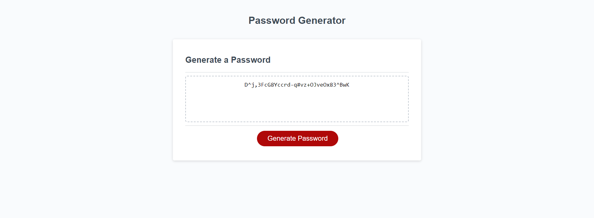

# Module 3 Project

## Description

This a password generator project as a part of week 3 assignments for the UofT Flex Bootcamp.

## Installation

N/A

## Usage

Click on 'Genarate Password' and select desired length and characters to include on the password. 

Please visit following link to see final results.

https://wesleyhas.github.io/password-generator-project/

## Preview of Page

## Credits

Credits to Xandromus who is the original creator of this code.

https://github.com/coding-boot-camp/friendly-parakeet

## License

Please refer to the LICENSE in the repo.